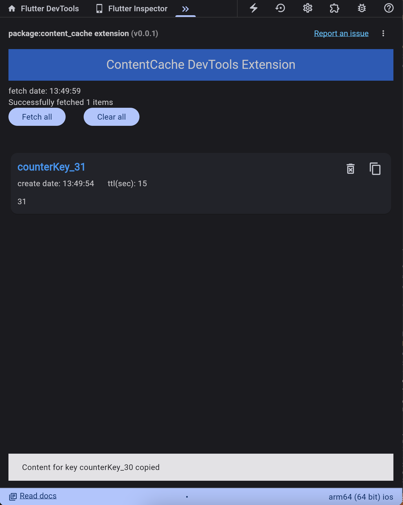

[](https://pub.dev/packages/content_cache/)
[](https://pub.dev/packages/content_cache/)
[](https://pub.dev/packages/content_cache/score)


# Content Cache Packages
simple key-value cache with Devtools Extension support

# Usage
### 1. install
dart pub add content_cache

### 2. methods
* Stream<Object> get onChangeStream;
* void save<T>(Object key, T content, {Duration ttl});
* bool isExists(Object key);
* T? retrieve<T>(Object key);
* T retrieveOrDefault<T>(Object key, T defaultVal);
* void clearAll();
* void remove(Object key);
* void dispose();


# Devtools
also this package allows you to see the cache data real-time




# Example

```dart
import 'package:content_cache/content_cache.dart';

void main() {
    final ContentCache contentCache = ContentCacheImpl();

    contentCache.save('counterKey', 'test1');
}
```